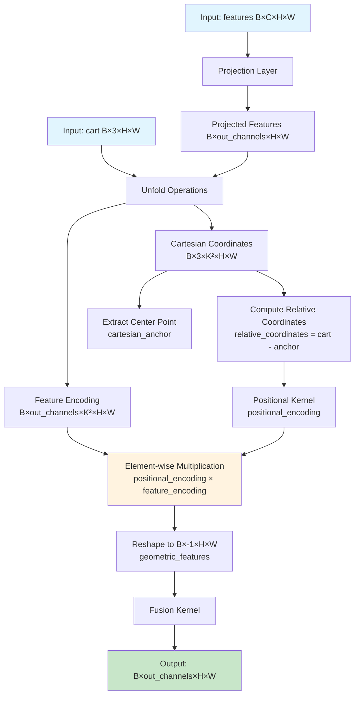
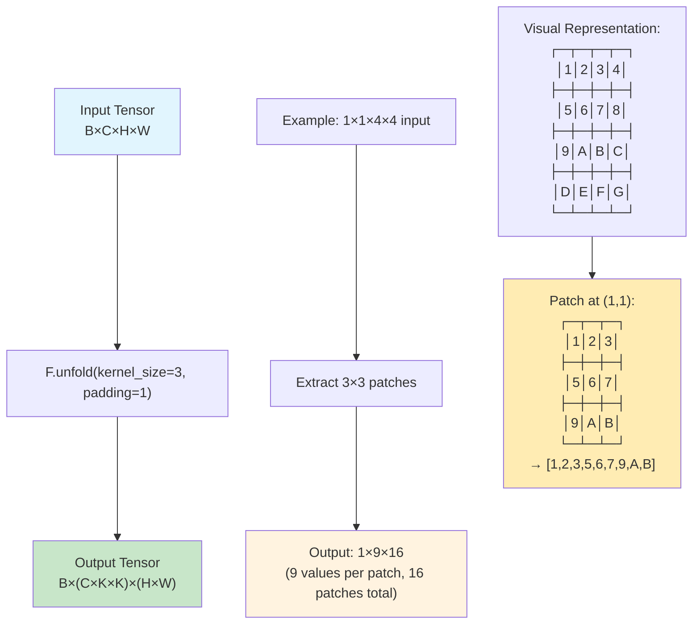
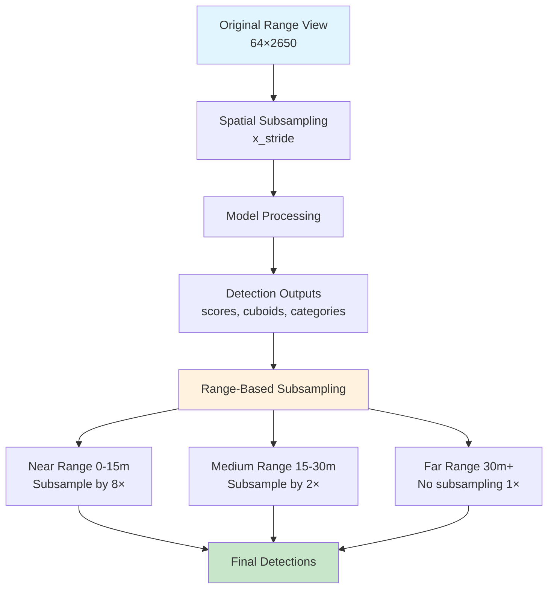
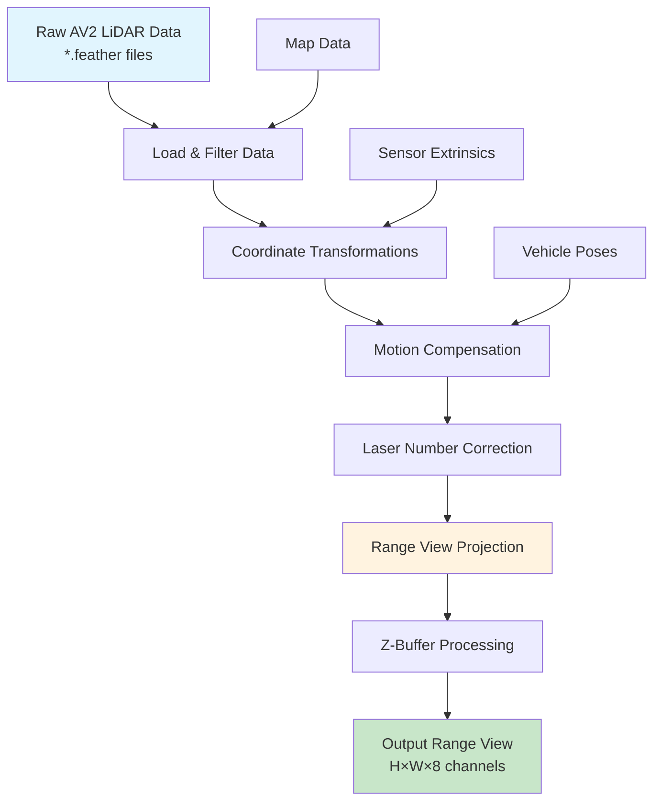

# Range View 3D Detection - Codebase Analysis

This document provides a comprehensive analysis of the range-view-3d-detection codebase structure, functionality, and architectural patterns.

## Project Overview

The range-view-3d-detection project appears to be a 3D object detection system that processes point cloud data using range view (bird's eye view) projections. The codebase is built using PyTorch Lightning and Hydra for configuration management.

## Configuration System Architecture

### Entry Point and Configuration Hierarchy

The project uses **Hydra** for hierarchical configuration management with the main entry point at `conf/config.yaml`. Here's the complete configuration relationship:

#### 1. Main Configuration (`conf/config.yaml`)
- **Role**: Root configuration file that sets up Hydra execution environment
- **Key Features**:
  - Defines experiment selection via `defaults` section with `- /experiment: ???` (must be specified at runtime)
  - Configures SLURM launcher for distributed training
  - Sets up output directories and logging paths
  - Contains cluster-specific settings (GPU allocation, partition selection, etc.)

#### 2. Experiment Configurations (`conf/experiment/`)
- **Base experiments**:
  - `base.yaml`: Abstract base requiring model, dataset, and trainer selection
  - `base-waymo.yaml`: Waymo-specific base configuration
  - `base-av2.yaml`: Argoverse 2 specific configuration
- **Concrete experiments**:
  - `rv-waymo.yaml`: Range view model on Waymo dataset
  - `rv-av2.yaml`: Range view model on Argoverse 2 dataset

#### 3. Component Configurations
The system follows a modular approach with three main component types:

**Model Configurations (`conf/model/`)**:
- `range_view.yaml`: Defines the CenterPoint-based range view architecture
  - Backbone: RangeNet with DLA-style architecture
  - Head: DetectionHead with FPN and classification/regression branches
  - Decoder: RangeDecoder with range-based subsampling
- `baseline.yaml`: Extends range_view with specific hyperparameters and augmentations

**Dataset Configurations (`conf/dataset/`)**:
- `waymo.yaml`: Waymo Open Dataset configuration
- `av2.yaml`: Argoverse 2 dataset configuration  
- `nuscenes.yaml`: nuScenes dataset configuration
- Each defines data loaders for train/val/test splits with range view projection parameters

**Trainer Configuration (`conf/trainer/`)**:
- `train.yaml`: PyTorch Lightning trainer setup
- Configures distributed training strategy (DDP)
- Sets precision (bf16-mixed), gradient clipping, learning rate monitoring
- Integrates with WandB for experiment tracking

#### 4. Configuration Composition Flow

The configuration resolution follows this inheritance chain:

```
conf/config.yaml (entry point)
    ↓
conf/experiment/{experiment_name}.yaml 
    ↓ (inherits from base)
conf/experiment/base-{dataset}.yaml
    ↓ (inherits from base)
conf/experiment/base.yaml
    ↓ (specifies components)
conf/model/{model_name}.yaml + conf/dataset/{dataset_name}.yaml + conf/trainer/train.yaml
```

**Example for `rv-waymo` experiment**:
1. `config.yaml` → requires experiment selection
2. `rv-waymo.yaml` → inherits from `base-waymo.yaml` + adds model overrides
3. `base-waymo.yaml` → inherits from `base.yaml` + adds dataset-specific settings
4. `base.yaml` → composes `baseline` model + `waymo` dataset + `train` trainer
5. Final composition includes all component configs with overrides applied

#### 5. Training Script Integration (`scripts/train.py`)

The configuration system integrates with the training pipeline as follows:

- **Hydra Decorator**: `@hydra.main(config_path="conf", config_name="config")`
- **Component Instantiation**: Uses `hydra.utils.instantiate()` to create:
  - `trainer`: PyTorch Lightning Trainer from `cfg.trainer`
  - `datamodule`: Data module from `cfg.dataset`  
  - `model`: Model from `cfg.model`
- **Runtime Configuration**: Supports multirun mode for hyperparameter sweeps via SLURM

#### 6. Key Design Patterns

- **Composition over Inheritance**: Components are composed rather than deeply inherited
- **Environment-Specific Defaults**: Separate base configs for different datasets
- **Override Mechanism**: Later configs can override earlier settings using `override /component:`
- **Variable Interpolation**: Extensive use of `${variable}` references for DRY principle
- **Target Pattern**: Uses `_target_` to specify Python class paths for instantiation

This configuration system enables flexible experimentation while maintaining reproducibility and modularity across different datasets, model architectures, and training configurations.

## Data Pipeline and Tensor Shapes

### Range View Data Processing

The project processes 3D point cloud data by projecting it onto a range view (2D bird's eye view) representation. Here's how the data flows through the pipeline and why you see specific tensor shapes:

#### Input Data Dimensions
For the Waymo dataset, the base range view configuration defines:
- **Height**: 64 (corresponding to laser channels/inclination bins)
- **Width**: 2650 (azimuth bins covering 360° rotation)

#### Feature Processing
From `conf/experiment/base-waymo.yaml`, the feature columns extracted are:
```yaml
feature_column_names:
  - "elongation"    # Elongation of the lidar return (Waymo-specific)
  - "intensity"     # Intensity of the lidar return  
  - "range"         # Distance to the point
  - "x"             # Cartesian X coordinate
  - "y"             # Cartesian Y coordinate
  - "z"             # Cartesian Z coordinate (6 features total initially)
```

**Note**: Elongation is **provided directly by the Waymo Open Dataset** as part of their native range image format. It is not calculated from LiDAR points but comes from Waymo's proprietary LiDAR processing pipeline. The Waymo range images contain 4 channels: `[range, intensity, elongation, no_label_zone_flag]`, where elongation represents the temporal spread/width of the laser pulse return.

For Argoverse 2, elongation is not available, so the base feature set is:
```yaml
feature_column_names:  # From range_view.yaml (default)
  - "intensity"
  - "range" 
  - "x"
  - "y"
  - "z"
```

However, the model configuration shows only 5 features are used (configurable via `in_channels: 6` but reduced to 5 in practice).

#### Tensor Shape Breakdown

**Your observed shapes: `features: (4, 5, 32, 1808)`, `mask: (4, 1, 32, 1808)`, `cart: (4, 3, 32, 1808)`**

1. **Batch Dimension (4)**: Your batch size is set to 4 samples
2. **Feature Dimension (5)**: 5 input features per pixel (subset of the 6 defined features)
3. **Height Dimension (32)**: Reduced from original 64 due to stride/subsampling
4. **Width Dimension (1808)**: Reduced from original 2650 due to padding and stride

#### Data Processing Steps

1. **Range View Construction** (`src/torchbox3d/math/range_view.py`):
   - Point cloud is converted to spherical coordinates
   - Points are mapped to 2D grid using laser numbers and azimuth angles
   - Z-buffering resolves multiple points per pixel (keeping closest)

2. **Subsampling** (`src/torchbox3d/prototype/loader.py:subsample_range_view()`):
   - For Waymo with default `x_stride=1`: padding of [3,3] is applied
   - Original width: 2650 → padded: 2656 → subsampled: depends on stride
   - Original height: 64 → reduced to 32 (likely 2x stride or processing)

3. **Collation** (`src/torchbox3d/utils/collater.py`):
   - Individual samples are stacked into batches
   - Tensors are moved to pinned memory for GPU transfer

#### Tensor Meanings and Why X,Y Features Are Needed

**Critical Distinction: Grid Coordinates vs. World Coordinates**

- **`features`**: Multi-channel range view image with LiDAR features including **world coordinates**
- **`mask`**: Binary mask indicating valid/invalid pixels (where range > 0)  
- **`cart`**: Cartesian **world coordinates** (x,y,z) for each range view pixel

**Why X,Y features are included despite having spatial dimensions:**

The 3rd and 4th dimensions (height×width) represent the **range view grid coordinates** - essentially the 2D image pixel positions that come from projecting 3D points onto a cylindrical surface using:
- **Height dimension**: Laser channel/inclination angle (which laser ring)
- **Width dimension**: Azimuth angle (horizontal rotation angle)

However, the **x,y features in the 2nd dimension** represent the actual **world coordinates** in meters of the original 3D points. These are crucial because:

1. **Different Coordinate Systems**: Grid (i,j) ≠ World (x,y,z)
   - Grid coordinates: Discrete indices in range view image
   - World coordinates: Continuous metric positions in 3D space

2. **Non-linear Mapping**: The relationship between grid position and world position is non-linear due to:
   - Spherical projection effects
   - Variable point densities at different ranges
   - Lidar beam geometry

3. **Essential for 3D Detection**: The model needs world coordinates to:
   - Predict actual 3D bounding box positions
   - Calculate distances and sizes in meters
   - Transform predictions back to world coordinate system

4. **Range View Distortion**: Points at different ranges map to the same grid position differently - nearby points have higher resolution than distant points.

**Example**: A grid position (32, 1000) might correspond to world coordinates (45.2m, 12.8m, 1.3m), but this relationship varies non-linearly across the range view.

This representation allows the model to process 3D detection as a 2D computer vision problem while preserving the essential metric information needed for accurate 3D predictions.

## Neural Network Architecture Components

### MetaKernel Implementation

The `MetaKernel` is a sophisticated neural network module that combines spatial features with geometric information by leveraging local neighborhoods and relative positioning. Here's how the `forward` method works:

#### MetaKernel.forward() Process Flow



#### Detailed Step-by-Step Breakdown

1. **Input Processing**:
   - `features`: Range view features (B×C×H×W) 
   - `cart`: Cartesian coordinates (B×3×H×W)

2. **Feature Projection**:
   ```python
   features = self.projection(features)  # B×C×H×W → B×out_channels×H×W
   ```

3. **Neighborhood Extraction via Unfold**:
   - **Feature Encoding**: Extracts K×K neighborhoods around each pixel
   ```python
   feature_encoding = F.unfold(features, K, padding=K//2)
   # Shape: B×out_channels×K²×(H×W)
   ```
   - **Cartesian Encoding**: Extracts corresponding spatial neighborhoods
   ```python
   cartesian_coordinates = F.unfold(cart, K, padding=K//2)
   # Shape: B×3×K²×(H×W)
   ```

4. **Relative Position Computation**:
   ```python
   center_idx = K²//2  # Center pixel in K×K neighborhood
   cartesian_anchor = cartesian_coordinates[:, :, center_idx:center_idx+1]
   relative_coordinates = cartesian_coordinates - cartesian_anchor
   ```
   This creates relative positions of neighboring points with respect to the center point.

5. **Positional Encoding**:
   ```python
   positional_encoding = self.positional_kernel(relative_coordinates)
   ```
   Learns spatial relationships using relative 3D coordinates.

6. **Geometric Feature Fusion**:
   ```python
   geometric_features = (positional_encoding * feature_encoding).view(B, -1, H, W)
   ```
   Element-wise multiplication combines spatial and feature information.

7. **Final Fusion**:
   ```python
   output = self.fusion_kernel(geometric_features)
   ```
   Processes the combined geometric features to produce final output.

#### Key Design Principles

- **Local Context**: Uses K×K neighborhoods (typically 3×3) to capture local spatial relationships
- **Translation Invariance**: Relative coordinates make the kernel robust to absolute position changes
- **Geometric Awareness**: Explicitly incorporates 3D spatial relationships into feature learning
- **Multi-scale Processing**: Combines low-level features with high-level geometric understanding

This design allows the network to learn spatially-aware features that understand both the appearance and geometric structure of the range view data, which is crucial for accurate 3D object detection.

### Understanding F.unfold()

`F.unfold()` is a PyTorch function that extracts **sliding local blocks** from a tensor. Think of it as "unfolding" or "unrolling" patches from an image into a matrix format.

#### What F.unfold() Does



#### Detailed Example

**Input**: A 4×4 image (for simplicity)
```
┌─┬─┬─┬─┐
│1│2│3│4│
├─┼─┼─┼─┤
│5│6│7│8│
├─┼─┼─┼─┤
│9│A│B│C│
├─┼─┼─┼─┤
│D│E│F│G│
└─┴─┴─┴─┘
```

**F.unfold(kernel_size=3, padding=1)** extracts all 3×3 patches:

- **Patch 1** (top-left corner with padding):
  ```
  ┌─┬─┬─┐
  │0│0│0│  ← padding
  ├─┼─┼─┤
  │0│1│2│
  ├─┼─┼─┤
  │0│5│6│
  └─┴─┴─┘
  ```
  → Flattened: `[0,0,0,0,1,2,0,5,6]`

- **Patch 2** (shifted right):
  ```
  ┌─┬─┬─┐
  │0│0│0│
  ├─┼─┼─┤
  │1│2│3│
  ├─┼─┼─┤
  │5│6│7│
  └─┴─┴─┘
  ```
  → Flattened: `[0,0,0,1,2,3,5,6,7]`

- **Patch at center**:
  ```
  ┌─┬─┬─┐
  │1│2│3│
  ├─┼─┼─┤
  │5│6│7│
  ├─┼─┼─┤
  │9│A│B│
  └─┴─┴─┘
  ```
  → Flattened: `[1,2,3,5,6,7,9,A,B]`

#### In MetaKernel Context

```python
# Original features: B×C×H×W
feature_encoding = F.unfold(features, self.num_neighbors, padding=padding).view(
    B, -1, self.num_neighbors**2, H * W
)
# Result: B×C×K²×(H×W)
# - Each of the H×W pixels now has K² neighboring feature values
# - K² = 9 for 3×3 neighborhoods

cartesian_coordinates = F.unfold(cart, self.num_neighbors, padding=padding).view(
    B, -1, self.num_neighbors**2, H * W
)
# Result: B×3×K²×(H×W) 
# - Each pixel has K² neighboring (x,y,z) coordinates
```

#### Why Use F.unfold() Here?

1. **Efficient Neighborhood Access**: Gets all K×K neighborhoods in one operation
2. **Parallel Processing**: All neighborhoods processed simultaneously
3. **Memory Layout**: Organizes data perfectly for the subsequent relative coordinate computation
4. **Flexible Kernel Sizes**: Easy to change neighborhood size (3×3, 5×5, etc.)

#### Key Insight

F.unfold() transforms the spatial convolution problem into a matrix multiplication problem. Instead of sliding a kernel over the image, it extracts all the patches that the kernel would see, allowing for more flexible processing of neighborhood relationships.

In MetaKernel, this is essential because we need to:
- Extract feature neighborhoods AND coordinate neighborhoods
- Compute relative positions between neighboring points
- Apply learned transformations to these geometric relationships

Without F.unfold(), you'd need complex indexing operations and loops to achieve the same neighborhood extraction efficiently.

## Range Subsampling in the Codebase

The codebase implements **two types of range subsampling** that occur at different stages of the pipeline:

### 1. Spatial Subsampling (Data Loading Stage)

**Location**: `src/torchbox3d/prototype/loader.py:subsample_range_view()`

**When**: During data loading, after range view construction but before model input

**How it works**:
```python
def subsample_range_view(range_view, mask, cart, dataset_name, x_stride, mode):
    # Dataset-specific padding
    if dataset_name == "waymo":
        pad = [19, 19] if x_stride == 4 else [3, 3]
    elif dataset_name == "av2":
        pad = [28, 28] if x_stride == 4 else [4, 4]
    
    # Apply subsampling
    range_view = F.pad(range_view, pad, mode=mode)[:, :, ::x_stride]
    mask = F.pad(mask, pad, mode=mode)[:, :, ::x_stride]
    cart = F.pad(cart, pad, mode=mode)[:, :, ::x_stride]
    return range_view, mask, cart
```

**Purpose**: Reduces azimuth resolution (width dimension) for computational efficiency

**Example**: With `x_stride=4` on Waymo:
- Original: 64×2650 → Padded: 64×2688 → Subsampled: 64×672
- Reduces width by factor of 4, keeping every 4th azimuth bin

### 2. Range-Based Subsampling (Inference Stage)

**Location**: `src/torchbox3d/nn/decoders/range_decoder.py:sample_by_range()`

**When**: During model inference, when processing detection outputs

**Configuration** (from `range_view.yaml`):
```yaml
_decoder:
  enable_sample_by_range: true
  lower_bounds: [0, 15, 30]      # meters
  upper_bounds: [15, 30, .inf]   # meters  
  subsampling_rates: [8, 2, 1]   # subsampling factors
```

**How it works**:
```python
def sample_by_range(scores, categories, cuboids, cart, lower_bounds, upper_bounds, subsampling_rates):
    # Compute distances from origin
    dists = cart.norm(dim=1, keepdim=True)
    
    # Create range partitions
    partitions = torch.logical_and(dists > lower_bounds, dists <= upper_bounds)
    
    for i, partition in enumerate(partitions):
        rate = subsampling_rates[i]
        # Apply different subsampling rates to different range partitions
        scores_list.append(scores * partition[:, :, ::, ::rate])
        # ::rate means take every 'rate'th element
```

**Purpose**: 
- **Near objects (0-15m)**: Subsample by 8× (fewer detections needed, objects are large)
- **Medium objects (15-30m)**: Subsample by 2× (moderate density)
- **Far objects (30m+)**: No subsampling (1×, need full resolution for small distant objects)

### Range Subsampling Strategy Explained



### Why This Strategy Works

1. **Spatial Subsampling**: Reduces computational cost while maintaining sufficient azimuth resolution
2. **Range-Based Subsampling**: Adapts detection density to object characteristics:
   - **Near objects**: Large in range view, fewer detections needed
   - **Far objects**: Small in range view, need full resolution to detect

### Configuration Impact

- `x_stride=1` (default): No spatial subsampling, full azimuth resolution
- `x_stride=4`: 4× spatial subsampling, reduces width by 75%
- Range subsampling is always enabled in the default configuration

This dual subsampling approach balances computational efficiency with detection accuracy across different distance ranges.

## Argoverse 2 Range View Data Conversion Pipeline

The `converters/av2/prepare_data.py` script transforms raw Argoverse 2 sensor data into range view format. Here's the detailed step-by-step process:

### Pipeline Overview



### Detailed Processing Steps

#### 1. **Data Loading and Filtering**
```python
# Load raw LiDAR sweep
lidar_lazy = pl.scan_ipc(sweep_path).select([
    "x", "y", "z", "intensity", "laser_number", "offset_ns"
])

# Filter by sensor (up_lidar vs down_lidar)
if sensor_name == "up_lidar":
    lidar_lazy = lidar_lazy.filter(pl.col("laser_number") <= 31)
elif sensor_name == "down_lidar":
    lidar_lazy = lidar_lazy.filter(pl.col("laser_number") >= 32)
```

**Purpose**: Select appropriate laser channels (AV2 has 64-channel LiDAR split into upper/lower)

#### 2. **ROI (Region of Interest) Filtering**
```python
# Transform to city coordinates and check map ROI
city_xyz = city_SE3_egovehicle[timestamp_ns].transform_from(lidar_points)
mask = avm.get_raster_layer_points_boolean(city_xyz, RasterLayerType.ROI)
lidar = lidar.with_columns(is_within_roi=pl.lit(mask))
```

**Purpose**: Filter points to road/drivable areas using HD map information

#### 3. **Motion Compensation (Optional)**
```python
def unmotion_compensate(sweep, poses, timestamp_ns, slerp):
    # Interpolate vehicle poses for each LiDAR point timestamp
    point_timestamps = timestamp_ns + sweep["offset_ns"]
    per_point_poses = slerp(point_timestamps).as_matrix()
    
    # Transform points to reference frame (sweep timestamp)
    # Removes motion blur from vehicle movement during sweep
```

**Purpose**: Corrects for vehicle motion during the ~100ms LiDAR sweep acquisition

#### 4. **Coordinate System Transformations**
```python
# Get sensor extrinsics (LiDAR → vehicle transformation)
sensor_SE3_egovehicle = SE3(rotation=rotation, translation=translation).inverse()
cart_lidar = sensor_SE3_egovehicle.transform_point_cloud(cart)

# Convert to spherical coordinates
sph = cart_to_sph(cart_lidar)  # [azimuth, inclination, radius]
```

**Purpose**: Transform from sensor coordinates to vehicle coordinates, then to spherical

#### 5. **Laser Number Correction**
```python
def correct_laser_numbers(laser_numbers, log_id, height):
    # Apply log-specific laser corrections (hardware calibration differences)
    if log_id in LOG_IDS:
        laser_numbers = apply_corrections(laser_numbers)
    
    # Map to range view rows using predefined mappings
    laser_mapping = ROW_MAPPING_32 if height == 32 else ROW_MAPPING_64
    return laser_mapping[laser_numbers]
```

**Purpose**: Corrects for hardware variations and maps laser channels to range view rows

#### 6. **Range View Coordinate Mapping**
```python
def build_range_view_coordinates(cart, sph, laser_numbers, laser_mapping, 
                                n_inclination_bins, n_azimuth_bins):
    azimuth, inclination, radius = sph[..., 0], sph[..., 1], sph[..., 2]
    
    # Map azimuth to column indices
    azimuth += math.pi  # Shift range from [-π,π] to [0,2π]
    azimuth_index = n_azimuth_bins - np.round(azimuth * n_azimuth_bins / (2*π))
    
    # Map inclination to row indices
    if build_uniform_inclination:
        # Use elevation angle directly (uniform angular spacing)
        inclination_index = map_elevation_to_rows(inclination, FOV)
    else:
        # Use laser channel mapping (hardware-specific spacing)
        inclination_index = n_inclination_bins - laser_mapping[laser_numbers] - 1
    
    return [inclination_index, azimuth_index, radius]
```

**Key Insight**: Two projection modes:
- **Laser-based**: Uses actual laser channel positions (non-uniform angular spacing)
- **Uniform**: Projects using uniform elevation angles (ignores hardware layout)

#### 7. **Z-Buffer Processing**
```python
@nb.njit  # Numba JIT compilation for speed
def z_buffer(indices, distances, features, height, width):
    image = np.zeros((num_channels, height * width))
    depth_buffer = np.full(height * width, np.inf)
    
    for i, pixel_idx in enumerate(raveled_indices):
        if distances[i] < depth_buffer[pixel_idx]:
            image[:, pixel_idx] = features[:, i]  # Keep closest point
            depth_buffer[pixel_idx] = distances[i]
    
    return image.reshape((num_channels, height, width))
```

**Purpose**: Resolves multiple points mapping to same pixel by keeping the closest

#### 8. **Feature Assembly**
```python
# Combine all features into 8-channel output
features = np.concatenate([
    lidar_features,      # [x, y, z, intensity, laser_number, is_within_roi]
    timestamp_ns[:, None],  # temporal offset within sweep
    distances[:, None]      # range values
], axis=-1).T

# Output channels: [x, y, z, intensity, laser_number, is_within_roi, timedelta_ns, range]
```

### Output Format

**Range View Dimensions**: `H×W×8`
- **H**: 32 or 64 (number of laser channels)
- **W**: 1800 (azimuth bins, ~0.2° resolution)
- **8 channels**: x, y, z, intensity, laser_number, is_within_roi, timedelta_ns, range

### Key Design Decisions

1. **Cylindrical Projection**: Preserves angular structure of rotating LiDAR
2. **Z-buffering**: Handles occlusion naturally (closer objects occlude farther ones)
3. **Hardware-aware Mapping**: Uses actual laser positions rather than uniform grid
4. **Multi-sensor Support**: Handles upper/lower LiDAR separately or combined
5. **Motion Compensation**: Optional correction for vehicle motion during sweep

This process transforms sparse, irregular 3D point clouds into dense, regular 2D range images that can be processed efficiently by convolutional neural networks while preserving the essential geometric and semantic information needed for 3D object detection.
